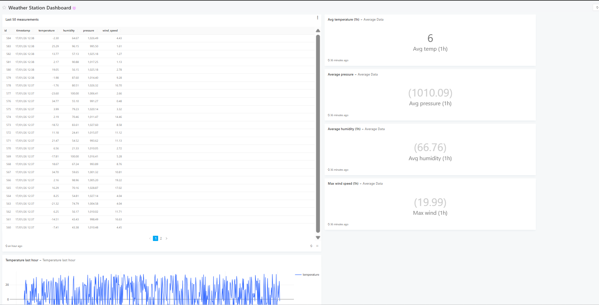
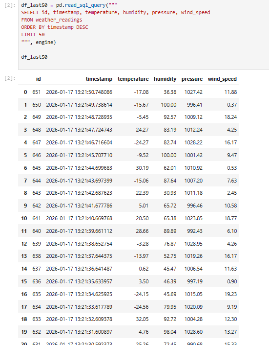
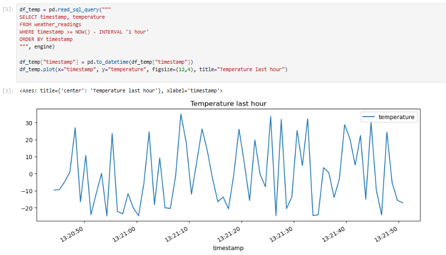
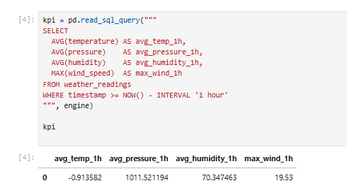

# Система мониторинга погодной станции

Простая end-to-end система для генерации, хранения и анализа данных с метеорологической станции.

## Компоненты системы

- **Python Generator**: Генерирует реалистичные данные о погоде каждую секунду
- **PostgreSQL**: Хранит все показания датчика
- **Redash**: Интерактивные дашборды и визуализации

## Параметры, которые собирает система

| Параметр       | Диапазон   | Единица |
|----------------|------------|---------|
| Температура    | -25 до +35 | °C      |
| Влажность      | 20-100     | %       |
| Давление       | 990-1030   | мбар    |
| Скорость ветра | 0-20       | м/с     |

## Быстрый старт

### Требования

- Docker Desktop (любая версия)
- Docker Compose 

### Запуск системы

#### 1. Перейти в папку проекта
cd Weather-station-system
#### 2. Запуск все контейнеров
docker-compose up

## Redash

Redash доступен: http://localhost:5000

В Redash создан дашборд "Weather Station Dashboard" с визуализациями:
- Таблицей последних 50 измерений
- Графиком температуры за последний час
- Карточками со средними значениями (температура/влажность/давление) и max скорости ветра

## Jupyter

Jupyter доступен: http://localhost:8888

- Таблица последних 50 измерений

- График температуры за последний час

- Средние значения и макс ветер
